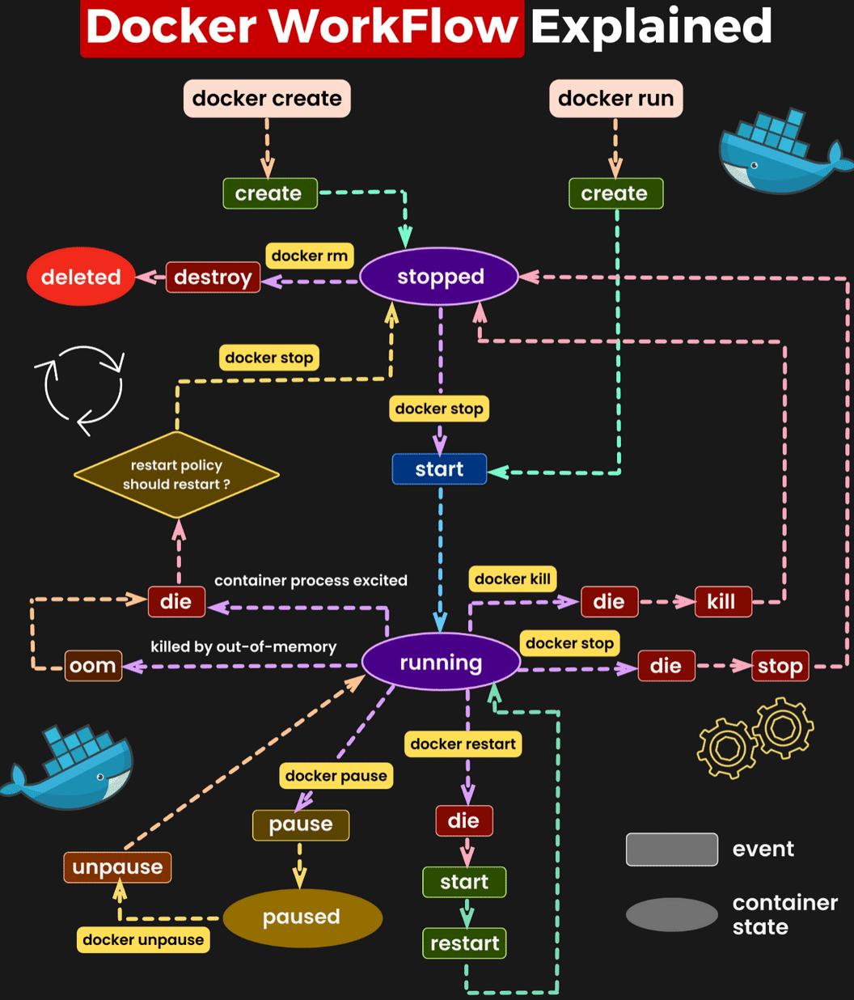

## Docker 🐳

---

### Table of Contents
1. [What is Docker?](#what-is-docker)
2. [Docker Installation](#docker-installation)
3. [Docker Commands Overview](#docker-commands-overview)
   - [Images](#images)
   - [Containers](#containers)
   - [Volumes](#volumes)
   - [Networks](#networks)
4. [Dockerfile Basics](#dockerfile-basics)
5. [Docker Compose](#docker-compose)
6. [System Management](#system-management)
7. [Advanced Docker Concepts](#advanced-docker-concepts)
8. [Docker Lifecycle Chart](#docker-lifecycle-chart)
9. [Best Practices](#best-practices)
10. [Troubleshooting](#troubleshooting)
11. [Workflow](#workflow)

---

### What is Docker? 📦
Docker is a platform for developing, shipping, and running applications inside lightweight, portable containers.  

---

### Docker Installation 🛠️
1. Download Docker from [docker.com](https://www.docker.com/)
2. Install Docker Desktop (Windows/macOS) or Docker Engine (Linux)
3. Verify installation:
   ```bash
   docker --version
   ```

---

### Docker Commands Overview ⚡

#### Images 🖼️
- List images:  
  ```bash
  docker images
  ```
- Pull an image:  
  ```bash
  docker pull <image-name>
  ```
- Remove an image:  
  ```bash
  docker rmi <image-id>
  ```
- Remove all unused images:
  ```bash
  docker image prune -a
  ```
- Build image with tag:
  ```bash
  docker build -t <image-name>:<tag> .
  ```
- Save image to tar file:
  ```bash
  docker save -o <output-file>.tar <image-name>
  ```
- Load image from tar file:
  ```bash
  docker load -i <input-file>.tar
  ```
- List image layers:
  ```bash
  docker history <image-name>
  ```

#### Containers 🛳️
- List running containers:  
  ```bash
  docker ps
  ```
- List all containers (including stopped):  
  ```bash
  docker ps -a
  ```
- Run a container:  
  ```bash
  docker run -d -p <host-port>:<container-port> <image-name>
  ```
- Stop a container:  
  ```bash
  docker stop <container-id>
  ```
- Remove a container:  
  ```bash
  docker rm <container-id>
  ```
- Execute command in running container:
  ```bash
  docker exec -it <container-id> <command>
  ```
- View container logs:
  ```bash
  docker logs <container-id>
  ```
- Follow container logs:
  ```bash
  docker logs -f <container-id>
  ```
- Copy files from container to host:
  ```bash
  docker cp <container-id>:/path/to/file /host/path
  ```
- Copy files from host to container:
  ```bash
  docker cp /host/path <container-id>:/path/to/file
  ```
- Restart container:
  ```bash
  docker restart <container-id>
  ```
- Remove all stopped containers:
  ```bash
  docker container prune
  ```

#### Volumes 📂
- Create a volume:  
  ```bash
  docker volume create <volume-name>
  ```
- List volumes:  
  ```bash
  docker volume ls
  ```
- Remove a volume:  
  ```bash
  docker volume rm <volume-name>
  ```
- Inspect volume:
  ```bash
  docker volume inspect <volume-name>
  ```
- Remove all unused volumes:
  ```bash
  docker volume prune
  ```

#### Networks 🌐
- Create a network:  
  ```bash
  docker network create <network-name>
  ```
- List networks:  
  ```bash
  docker network ls
  ```
- Connect a container to a network:  
  ```bash
  docker network connect <network-name> <container-id>
  ```
- Disconnect container from network:
  ```bash
  docker network disconnect <network-name> <container-id>
  ```
- Remove network:
  ```bash
  docker network rm <network-name>
  ```
- Inspect network:
  ```bash
  docker network inspect <network-name>
  ```

---

### Dockerfile Basics 🗞️
1. Create a `Dockerfile`:
   ```dockerfile
   # Use base image
   FROM python:3.9-slim

   # Set working directory
   WORKDIR /app

   # Copy files
   COPY . .

   # Install dependencies
   RUN pip install -r requirements.txt

   # Expose port
   EXPOSE 5000

   # Run the application
   CMD ["python", "app.py"]
   ```
2. Build the image:  
   ```bash
   docker build -t <image-name> .
   ```
3. Build with no cache:
   ```bash
   docker build --no-cache -t <image-name> .
   ```
4. Build with build arguments:
   ```bash
   docker build --build-arg VAR=value -t <image-name> .
   ```

---

### Docker Compose 🪩
- Create a `docker-compose.yml`:
   ```yaml
   version: '3.8'
   services:
     app:
       build: .
       ports:
         - "5000:5000"
       volumes:
         - .:/app
       networks:
         - app-network
   networks:
     app-network:
       driver: bridge
   ```
- Start services:  
  ```bash
  docker-compose up -d
  ```
- Stop services:  
  ```bash
  docker-compose down
  ```
- Build and start services:
  ```bash
  docker-compose up -d --build
  ```
- View service logs:
  ```bash
  docker-compose logs -f
  ```
- Scale services:
  ```bash
  docker-compose up -d --scale service=3
  ```
- List services:
  ```bash
  docker-compose ps
  ```
- Execute command in service:
  ```bash
  docker-compose exec <service-name> <command>
  ```

---

### System Management 🔧
- View Docker system information:
  ```bash
  docker system info
  ```
- Show disk usage:
  ```bash
  docker system df
  ```
- Clean up system (remove unused data):
  ```bash
  docker system prune
  ```
- Clean up everything:
  ```bash
  docker system prune -a --volumes
  ```

---

### Advanced Docker Concepts 🌐

#### Multi-Stage Builds
Use multi-stage builds to optimize image size:
```dockerfile
# First stage
FROM node:16 AS builder
WORKDIR /app
COPY package*.json ./
RUN npm install
COPY . .
RUN npm run build

# Second stage
FROM nginx:alpine
COPY --from=builder /app/build /usr/share/nginx/html
EXPOSE 80
CMD ["nginx", "-g", "daemon off;"]
```

#### Docker Secrets
Manage sensitive data securely:
```bash
# Create a secret
printf "mysecretpassword" | docker secret create db_password -

# Use in a service (Docker Swarm)
docker service create --name mydb --secret db_password mysql:5.7
```

#### Debugging Containers
- Attach to a container:
  ```bash
  docker attach <container-id>
  ```
- Debug using a different shell:
  ```bash
  docker exec -it <container-id> /bin/sh
  ```
- View resource usage:
  ```bash
  docker stats
  ```

---

### Docker Lifecycle Chart 🔄
```plaintext
Image Management
    Pull → docker pull
    Build → docker build
    Remove → docker rmi

Container Management
    Run → docker run
    Stop → docker stop
    Remove → docker rm

Volume & Network
    Create → docker volume create / docker network create
    Connect → docker network connect
    Remove → docker volume rm / docker network rm
```

---

### Best Practices ✅
- Use `.dockerignore` to exclude unnecessary files.
- Keep your `Dockerfile` small and efficient.
- Use multi-stage builds to reduce image size.
- Avoid running containers as root.
- Regularly clean unused images, containers, and volumes:
  ```bash
  docker system prune -a
  ```

---

### Troubleshooting 🛠️
- View logs of a container:  
  ```bash
  docker logs <container-id>
  ```
- Access a running container shell:  
  ```bash
  docker exec -it <container-id> /bin/bash
  ```
- Debug container network issues:  
  ```bash
  docker network inspect <network-name>
  ```

---

### Workflow 🖋




---

### Workflow 📝

](../images/docker.gif)