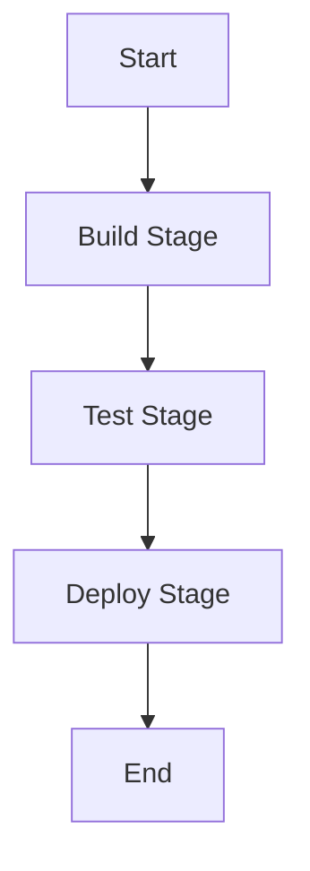

# 🚀 Jenkins Notes

## 📜 Table of Contents
1. [Introduction to Jenkins](#introduction-to-jenkins)
2. [Installing Jenkins](#installing-jenkins)
3. [Configuring Jenkins](#configuring-jenkins)
4. [Creating Jobs](#creating-jobs)
5. [Pipeline as Code](#pipeline-as-code)
6. [Jenkins Plugins](#jenkins-plugins)
7. [Managing Builds](#managing-builds)
8. [Integrations](#integrations)
9. [Best Practices](#best-practices)

---

## 🛠️ Introduction to Jenkins
Jenkins is an open-source automation server written in Java. It helps automate the building, testing, and deploying of software projects.

### 🔑 Key Features:
- Continuous Integration/Continuous Delivery (CI/CD)
- Distributed builds
- Extensible with plugins
- Pipeline as code (Jenkinsfile)

---

## 💻 Installing Jenkins

1. **Pre-requisites**:
   - Java 11 or newer.
   - Supported OS: Windows, macOS, Linux.

2. **Steps to Install**:
   - Download Jenkins from [Jenkins Downloads](https://www.jenkins.io/download/).
   - Install using the installer for your platform.
   - Start Jenkins:
     ```bash
     java -jar jenkins.war
     ```

3. **Access Jenkins**:
   - Open `http://localhost:8080` in your browser.
   - Enter the initial admin password from the setup wizard.

---

## ⚙️ Configuring Jenkins

1. **Setup Admin User**:
   - Navigate to `Manage Jenkins > Security Settings`.
   - Create an admin user.

2. **Configure Tools**:
   - Go to `Manage Jenkins > Global Tool Configuration`.
   - Set up JDK, Maven, Git, etc.

3. **Configure System**:
   - Add SMTP for email notifications (`Manage Jenkins > Configure System`).
   - Set up disk usage monitoring.

---

## 🏗️ Creating Jobs

1. **Freestyle Jobs**:
   - Click on `New Item`.
   - Select "Freestyle Project".
   - Configure:
     - **Source Code Management**: Add Git repository URL.
     - **Build Triggers**: Poll SCM or build periodically.
     - **Build Steps**: Execute shell commands or run a script.

2. **Build Pipeline Jobs**:
   - Use the Pipeline or Multibranch Pipeline option.
   - Add a `Jenkinsfile` to your repository for pipeline definitions.

---

## 📝 Pipeline as Code

### Example `Jenkinsfile`:
```groovy
pipeline {
    agent any
    stages {
        stage('Build') {
            steps {
                echo 'Building the project...'
                sh 'mvn clean install'
            }
        }
        stage('Test') {
            steps {
                echo 'Running tests...'
                sh 'mvn test'
            }
        }
        stage('Deploy') {
            steps {
                echo 'Deploying the application...'
            }
        }
    }
}
```

### 🗺️ Jenkins Pipeline Flowchart:


---

## 🔌 Jenkins Plugins

### Popular Plugins:
- 🧩 **Pipeline**: Build complex workflows.
- 🔧 **Git**: Integrate Git repositories.
- 📊 **Blue Ocean**: Visualize pipelines.
- ✉️ **Email Extension**: Send build notifications.
- 🐳 **Docker**: Manage Docker containers.

---

## 🔄 Managing Builds

1. **Triggering Builds**:
   - Manually or schedule builds via cron.
   - Trigger builds from Git webhooks.

2. **Viewing Build History**:
   - Check status, logs, and artifacts from the job dashboard.

3. **Managing Build Nodes**:
   - Add and configure slave nodes for distributed builds.

---

## 🤝 Integrations

1. **Version Control**:
   - Git, GitHub, Bitbucket.

2. **Containerization**:
   - Docker, Kubernetes.

3. **Cloud Platforms**:
   - AWS, Azure, Google Cloud.

4. **Notifications**:
   - Slack, Email.

---

## 🏅 Best Practices

1. 🔑 Secure Jenkins:
   - Use Role-Based Access Control (RBAC).
   - Keep Jenkins updated.

2. 🌲 Maintain Clean Logs:
   - Archive old builds.
   - Monitor disk space.

3. 📜 Use Declarative Pipelines:
   - Maintain pipelines in version control.

4. 🚀 Optimize Build Agents:
   - Distribute builds across nodes.
   - Use lightweight containers for builds.

5. 🔄 Backup Configuration:
   - Regularly back up `JENKINS_HOME`.

---
 